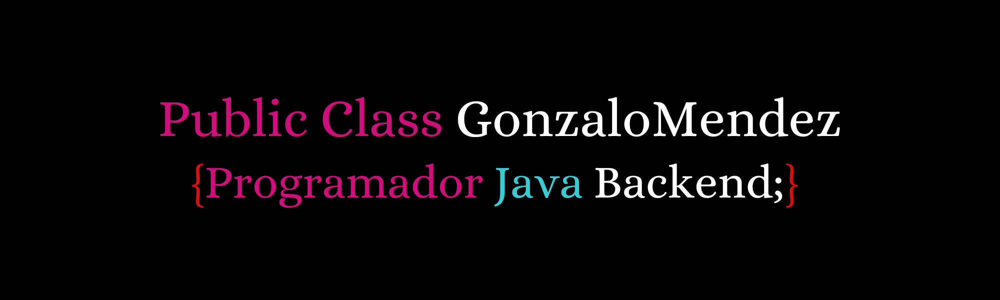

<h1 align="center">Hola soy Gonzalo </h1>

## Sobre Mi

Soy un programador de <b>JAVA</b>. Actualmente manejo <b>JPA</b>, <b>POO</b>, <b>JAVA(EE)</b> y ando aprendiendo <b>SPRINGBOOT</b>. También poseo conocimientos en <b>MySQL</b>, <b>HTML</b>, <b>CSS</b> y <b>JavaScript</b>. Me interesaría especializarme en frontend pero mi lugar está en la lógica y en cómo funcionan las cosas por detras.

## Tecnologias

<!--
**Gonza-JavaDev/Gonza-JavaDev** is a ✨ _special_ ✨ repository because its `README.md` (this file) appears on your GitHub profile.

Here are some ideas to get you started:

- 🔭 I’m currently working on ...
- 🌱 I’m currently learning ...
- 👯 I’m looking to collaborate on ...
- 🤔 I’m looking for help with ...
- 💬 Ask me about ...
- 📫 How to reach me: ...
- 😄 Pronouns: ...
- ⚡ Fun fact: ...
-->
